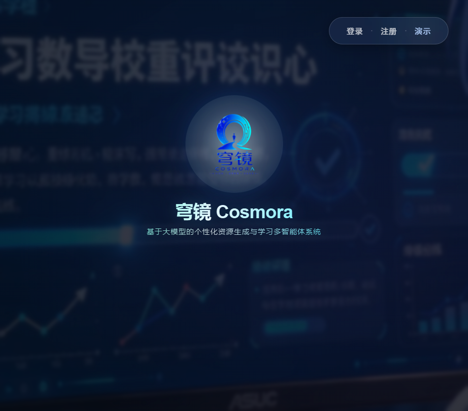
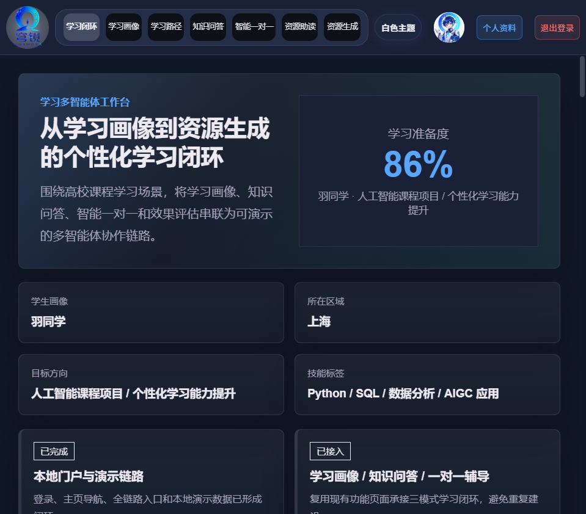
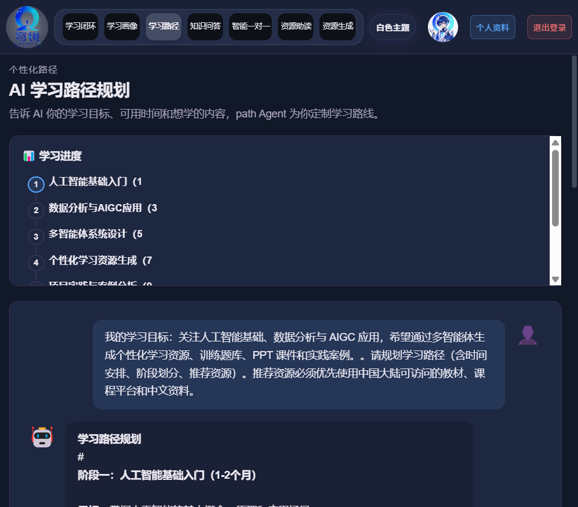
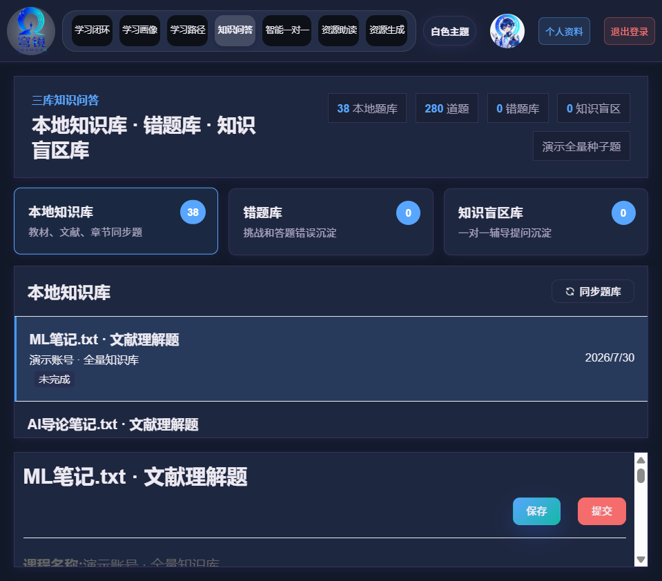
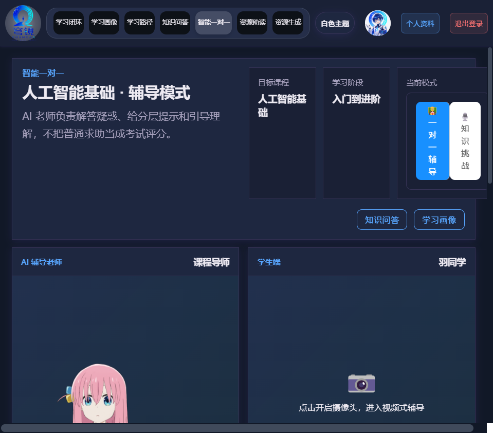
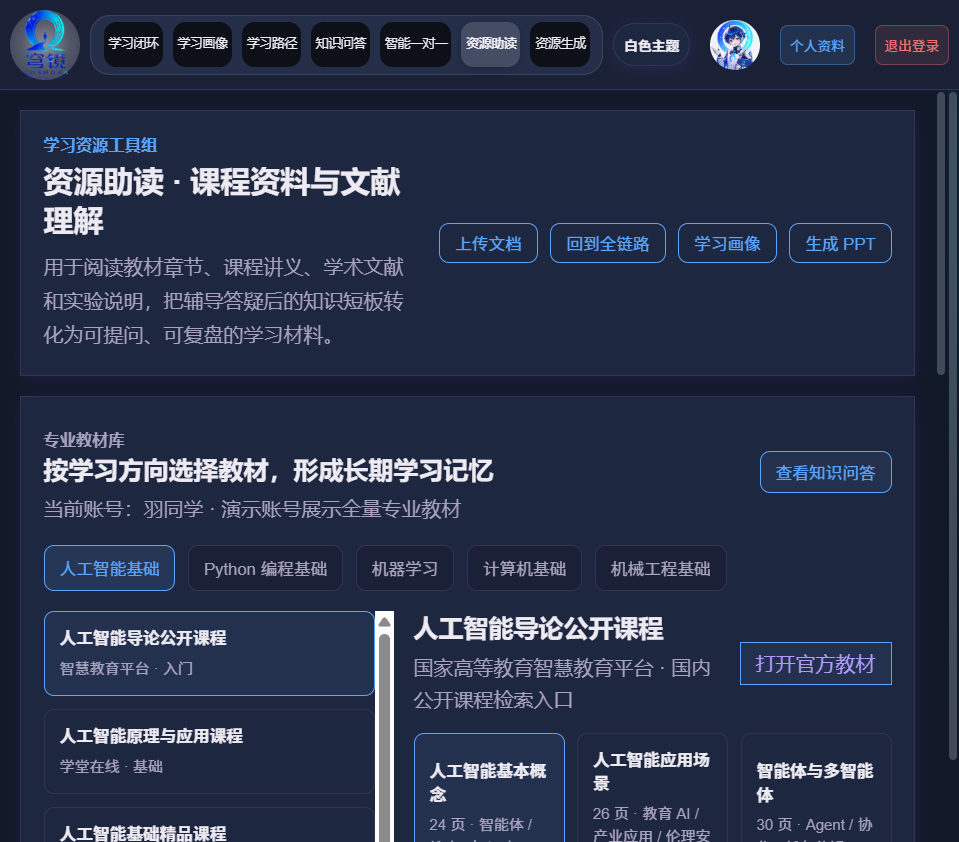
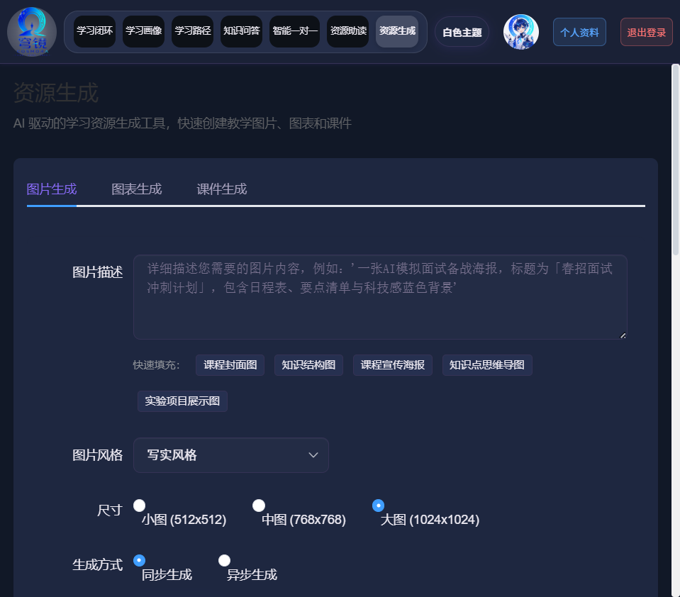

# 穹镜 Cosmora

> 🧠 **基于大模型的个性化资源生成与学习多智能体系统**

[](LICENSE)
[](https://www.oracle.com/java/)
[](https://vuejs.org/)
[](https://www.xfyun.cn/)

---

## 📖 项目简介

穹镜 Cosmora 是一个 **AI 驱动的智慧教学平台**，面向高校课程学习场景，整合**科大讯飞**全线 AI 能力（星火大模型、HiDream 图片生成、PPT、ChatDoc、语音），为学生提供完整学习闭环。

---

## 🖥 页面展示

### 登录页


### 学习闭环 — 多智能体工作台


### 学习路径 — 个性化推荐


### 知识问答 — 三库系统


### 智能一对一 — 依莉 AI 老师（Live2D）


### 资源助读 — 教材与文档分析


### 资源生成 — 图片/图表/课件


---

## ✨ 功能一览

| 模块 | 功能亮点 |
|------|---------|
| 🏠 **学习闭环** | 多智能体工作台，4/4 讯飞 AI 已配置，五步学习流程 |
| 📊 **学习画像** | 8 维度能力雷达图，学习准备度/薄弱点可视化 |
| 🗺️ **学习路径** | AI 路径 Agent 个性化推荐学习步骤与资源 |
| 📝 **知识问答** | 30 套题库 270+ 题，三库系统（本地/错题/盲区） |
| 👩‍🏫 **智能一对一** | 辅导+挑战双模式，Live2D 依莉角色，语音交互 |
| 📖 **资源助读** | 5 方向 45 本教材，文档上传 AI 分析 |
| 🎨 **资源生成** | HiDream AI 生图 + ECharts 图表 + PPT 课件 |

---

## 🚀 快速开始

### 环境
- Java 8+ & Maven 3.9+
- Node.js 16+
- MySQL 8.0
- [科大讯飞开发者账号](https://console.xfyun.cn)

```bash
# 1. 数据库
mysql -u root -p < database/teacher_course.sql

# 2. 后端
cd backend && mvn package -DskipTests
java -jar target/LessonDesign-0.0.1-SNAPSHOT.jar

# 3. 前端
cd frontend && npm install && npm run serve

# 4. 访问
open http://localhost:8081  → 点击 "演示" 体验
```

---

## 📡 AI API 状态

| 服务 | 接口 |
|------|------|
| 🎨 图片生成 HiDream | `POST /api/image/generate` |
| 🧠 星火大模型 | `POST /api/learning-agent/chat` |
| 🎤 语音 TTS/IAT | `POST /api/voice/tts` |
| 📊 PPT 生成 | `POST /api/generate-ppt` |
| 📄 文档阅读 | `POST /api/document/upload` |

---

## 🏗 技术栈

| 层 | 技术 |
|----|------|
| 前端 | Vue 2.6 · Element UI · ECharts 5 · DOMPurify |
| 后端 | Spring Boot 2.6 · MyBatis · MySQL 8.0 · OkHttp 4 |
| AI | 讯飞星火 · HiDream · PPT API · ChatDoc · 语音 |
| Live2D | Cubism SDK 5 · PixiJS 6（依莉角色）|
| 大屏 | Vue 3 · Vite · Three.js · GSAP |

---

## 📂 项目结构

```
Cosmora/
├── backend/          # Spring Boot (9070)
├── frontend/         # Vue2 (8081)
├── database/         # MySQL
├── AI/               # Flask 面试服务 (5333)
├── bigscreen/        # 3D 大屏 (5173)
└── docs/             # 文档
```

---

**穹镜 Cosmora** — 从学习画像到资源生成的 AI 全链路学习平台。
